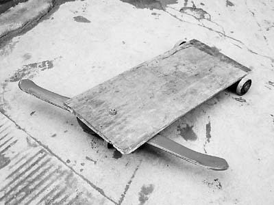

# 鲲鹏战车 

队伍名 | 项目名 | Github 地址 |
-------|--------|-------------|
鲲鹏战队 | 鲲鹏战车 | https://github.com/Eronwu/roc_robot |

----------
### 感言
记得小时候大约10岁的时候那个时候家里穷没有玩具玩，某天发现老爸以前矿山里挖煤留下的工具箱里有几个崭新的轴承，如获至宝，赶紧找来锯子和木板制作了人生第一台车，大概效果如下

当时带着自制小车，在村口玩的时候，在小伙伴们里的风靡程度，不亚于现在一台跑车的回头率

 

就这样这辆小车陪伴我过了美好的童年，不过我永远不会忘记当年山坡翻车那个场景，如今我手背那块块疤就是当年的记忆。最后一次见到那台车，应该是14年回老家还看到老屋角落躺着我的那辆木制轴承车，后面就没有了。。。。。
放一张我想我当时玩的时候大概是这样子做个纪念吧！！！

 

后来上大学选了自己最爱的电子专业，错过了飞思卡尔智能车比赛（两年一届），但是那个时候还没有Robomaster都没机会再玩到车，非常的遗憾。工作5，6年后偶然看到RT-thread举办的战车制作活动，就毫不犹豫就参加了，一路制作没有遇到太多艰辛，只完成了最基础的功能，有些遗憾，但是恰好30来临之际，记录一下做车的过程，算是给自己的生日礼物好了。

### 制作过程

- [器件选型篇请点这里](application/roc_car/docs/material_part.md)

- [小车组装改造接线点击](application/roc_car/docs/assemble_part.md)

- [软件环境搭建](application/roc_car/docs/env_part.md)

- [pwm,板载wifi驱动移植](application/roc_car/docs/wifi_driver_part.md)

- [软件框架，控制协议、全向控制基础原理](application/roc_car/docs/app_code_part.md)

- [应用编写，手机遥控器wifi控制](application/roc_car/docs/mobile_wifi_code_part.md)

- [应用编写，闭环控制 暂时未能实现调试好，后面补上 ]()

### 总结
1. 一开始想做战车类型，所以电机选型太大，驱动板功率很大，但是车上是亚克力，整个车容易“暴动”，需要装减震器。
2. 前期太注重软件框架和wifi控制协议编写，导致没有时间做闭环控制调试，但是后面加入进去。
3. 未能把摄像头云台加进去。
4. 后面有想法用树莓派4或者jetson nano主板来做
5. 最开心的是rt-thread组织这个活动认识了一大帮做车的大牛，特别是指导老师吴博的知识渊博打开我的视野，另外一个吴鹏对技术的纯粹执着的态度令我敬佩。
6. 当然也要非常感谢吴波基友和其他队友的支持
