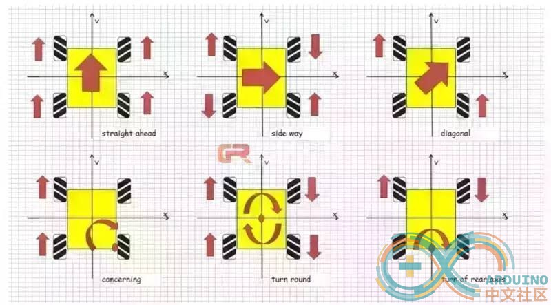
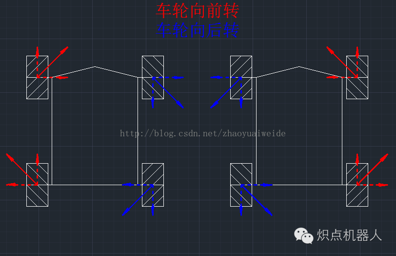
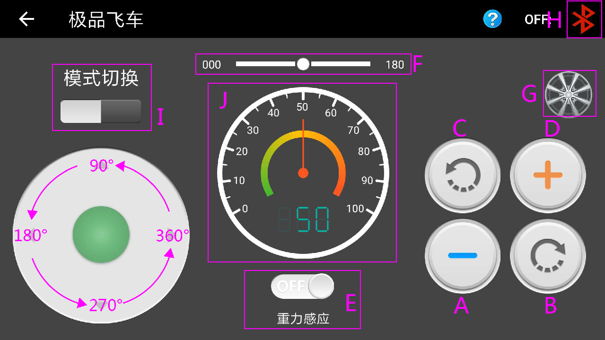
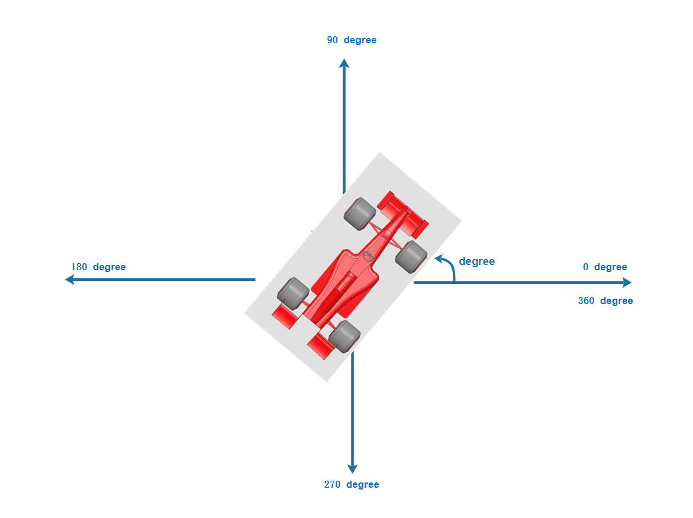

# 软件框架
-------------
### 代码目录

application\roc_car\applications

### 代码架构(这部分树状图请用raw格式查看 = =)

roc_car
│
├─docs
│      *.md							// 文档介绍
│
├─applications
│      main.c						// 主入口
│      main.h
│      protocol.h     			// 协议头文件
│      protocol_parser.c	// 协议解析文件
│	 protocol_parser.h
│	 roc_robot.c				// 小车控制函数文件
│	 roc_robot.h
│	 tcprecv.c					// tcp 接受数据函数
│	 wifi_connect.c
│	 
├─ports
└─SConscript                // RT-Thread 默认的构建脚本

对于电机的控制直接采用了 RT-Thread官方的[rt-robot](https://github.com/RT-Thread-packages/rt-robot)框架，我使用的单路pwm驱动方式，为了方便使用这个框架我对rt-robot再做了一层封装
```
typedef struct {
    single_pwm_motor_t left_forward_motor, left_backward_motor, right_forward_motor, right_backward_motor;
    ab_phase_encoder_t left_forward_encoder, left_backward_encoder, right_forward_encoder, right_backward_encoder;
    inc_pid_controller_t left_forward_pid, left_backward_pid, right_forward_pid, right_backward_pid;
    wheel_t left_forward_wheel, left_backward_wheel, right_forward_wheel, right_backward_wheel;

    motor_t x_servo, y_servo;
    kinematics_t c_kinematics;
    E_ROC_ROBOT_STATUS status;
    rt_int8_t speed ;
    rt_int16_t degree;
}ST_ROC_ROBOT;
```
使用的时候再封装如下几个操作函数：

	roc_robot_init() 
	roc_robot_go_forward()
	roc_robot_go_backward() 
	roc_robot_turn_right()
	roc_robot_turn_right_rotate()
	roc_robot_turn_left()
	roc_robot_turn_left_rotate()
	roc_robot_stop()

### 控制基础原理
为了实现上面几个函数我们需要了解一些最基本的原理，首先我们控制小车前进，后退，向左，向右,左旋，右旋这六个个基本功能



旋转原理



前面只是几个基本动作的控制，如果我们要实现全相控制呢？那么我们需要学习一下基础原理知识
通过这篇[麦克纳姆轮控制原理](https://blog.csdn.net/qq_33835307/article/details/82252293)文章的讲解
我们知道，全向移动底盘是一个纯线性系统，而刚体运动又可以线性分解为三个分量。那么只需要计算出麦轮底盘在Vx「沿X轴平移」、Vy「沿Y轴平移」、w「绕几何中心自转」时，四个轮子的速度，就可以通过简单的加法，计算出这三种简单运动所合成的「平动+旋转」运动时所需要的四个轮子的转速。而这三种简单运动时，四个轮子的速度可以通过简单的测试，或是推动底盘观察现象得出。

当底盘沿着 X 轴平移时：

	V左前 = +Vx
	V右前 = -Vx
	V左后 = - Vx
	V右后 = +Vx

当底盘沿着 Y 轴平移时：

	V左前 =  Vy
	V右前 =  Vy
	V左后 =  Vy
	V右后 =  Vy

当底盘绕几何中心自转时：

	V左前 =  W
	V右前 =  -W
	V左后 = W
	V右后 = -W

将以上三个方程组相加，得到的恰好是根据「传统」方法计算出的角度，

综合到一起就是

	V左前 = +Vx + Vy + W
	V右前 = -Vx + Vy -W
	V左后 = - Vx + Vy + W
	V右后 = +Vx + Vy -W

由于 rt-robot 的全向控制和我遥控程序的坐标系不同所以重新实现了一下这个函数

```
void roc_robot_run(rt_int16_t x, rt_int16_t y, rt_int16_t rotate)
{
    rt_int16_t lf_speed = x + y + rotate; 
    rt_int16_t lb_speed = -x + y + rotate;
    rt_int16_t rf_speed = -x + y -rotate;
    rt_int16_t rb_speed = x + y - rotate;
    single_pwm_motor_set_speed(roc_robot.left_forward_motor, lf_speed *10);
    single_pwm_motor_set_speed(roc_robot.left_backward_motor, lb_speed *10);
    single_pwm_motor_set_speed(roc_robot.right_forward_motor, rf_speed *10);
    single_pwm_motor_set_speed(roc_robot.right_backward_motor, rb_speed *10);
}
```
前面已经把基础原理介绍了一遍，那我们到底怎么来实现wifi遥控呢？
### 协议部分
	typedef struct
	{
	    rt_uint8_t start_code ;   // 8bit 0xAA
	    rt_uint8_t len;           // protocol package data length
	    E_ROBOT_TYPE type;
	    rt_uint8_t addr;
	    E_CONTOROL_FUNC function;      // 8 bit
	    rt_uint8_t *data;         // n bit
	    rt_uint16_t sum;       // check sum 16bit
	    rt_uint8_t end_code;      // 8bit 0x55
	} ST_PROTOCOL; // wifi数据字节流结构体

	typedef enum
	{
	    E_BATTERY = 1,
	    E_LED,
	    E_BUZZER,
	    E_INFO,
	    E_ROBOT_CONTROL_DIRECTION,  //机器人控制角度 （0~360）
	    E_ROBOT_CONTROL_SPEED,      //机器人控制速度 （0~100）
	    E_TEMPERATURE,
	    E_INFRARED_TRACKING,
	    E_ULTRASONIC,
	    E_INFRARED_REMOTE,
	    E_INFRARED_AVOIDANCE,
	    E_CONTROL_MODE,  //12
	    E_BUTTON,
	    E_LED_MAXTRIX,
	    E_CMD_LINE,
	    E_VERSION,
	    E_UPGRADE,
	    E_PHOTORESISTOR,
	    E_SERVER_DEGREE,
	    E_CONTOROL_CODE_MAX,
	} E_CONTOROL_FUNC; // wifi控制指令功能部分

我们先来看下wifi遥控界面张什么样子




Android端APP界面示意图

-	“A、D”部分为加减速按钮。
-	“B”部分为右自旋。
-	“C”部分为左自旋。
-	“E”部分为重力遥感开关，可切换到重力遥感模式
-	“I” 部分为遥控手柄切换。
-	“J” 部分为当前速度显示。
-	通过上面图片我们知道我将0~360度作为全向运动的方向角，基础控制速度可调节，左右旋转独立

我们先建立如下一个xy 轴和0~360度的对应控制关系坐标系如下




假如这个时候我们从wifi获取到角度 为 degree，由于apk设计原因，没有做旋转角度指盘
那么x轴和y轴的速度为如下

	Vx = cos(degree) * speed
	Vy = sin(degree)*speed

上面这个计算公式，就可以很容易实现如下代码

```
void roc_robot_drive(rt_uint16_t degree)
{
    LOG_D("roc_robot_drive %d", degree);
    rt_int16_t x, y;

    if (degree == 0XFFFF) {
        roc_robot_stop();
    } else {
        x = cos(degree)*roc_robot.speed;
        y = sin(degree)*roc_robot.speed;
        roc_robot_run(x, y, 0);
    }
}
```

### 整个程序流程如下：

	main.c:

	wifi_auto_connect(); // 自动链接wifi热点函数

	roc_robot_init(0); // 使用RT-Robot框架初始化RT-Robot驱动, 函数前进后退方法都在roc_robot.c里面

	rt_thread_create("led_flash", led_flash... // 判断wifi连接情况起的线程

	ret = rt_thread_create("wifi_control", wifi_control... // 将接受的wifi数据转化为指令执行

	tcprecvserv((void *)pareser_package.buffer); // 接受wifi数据到data下

### 代码流程

```flow
st=>start: main.c
op1=>operation: Wifi connect|past
op2=>operation: rt-robot init|current
op3=>operation: wifi led|current
io=>inputoutput: data receive|request
op4=>operation: execute distruction|current
sub1=>subroutine: My Subroutine|invalid
c2=>condition: Good idea|rejected

st->op1->op2->io->op4->io
sub1(left)->op1

```

