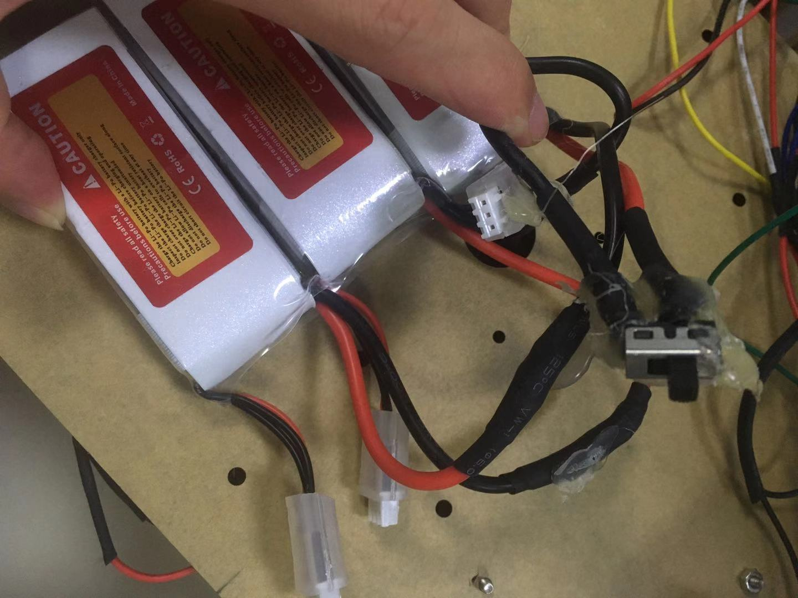
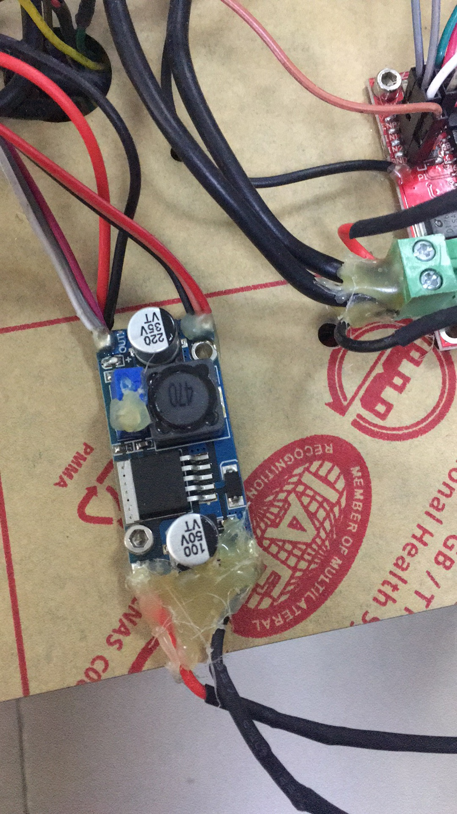
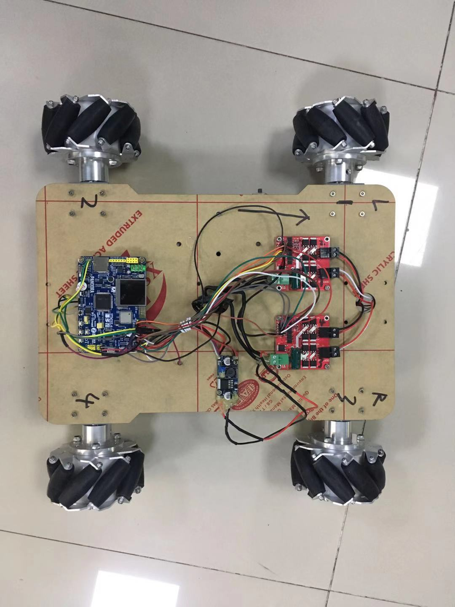
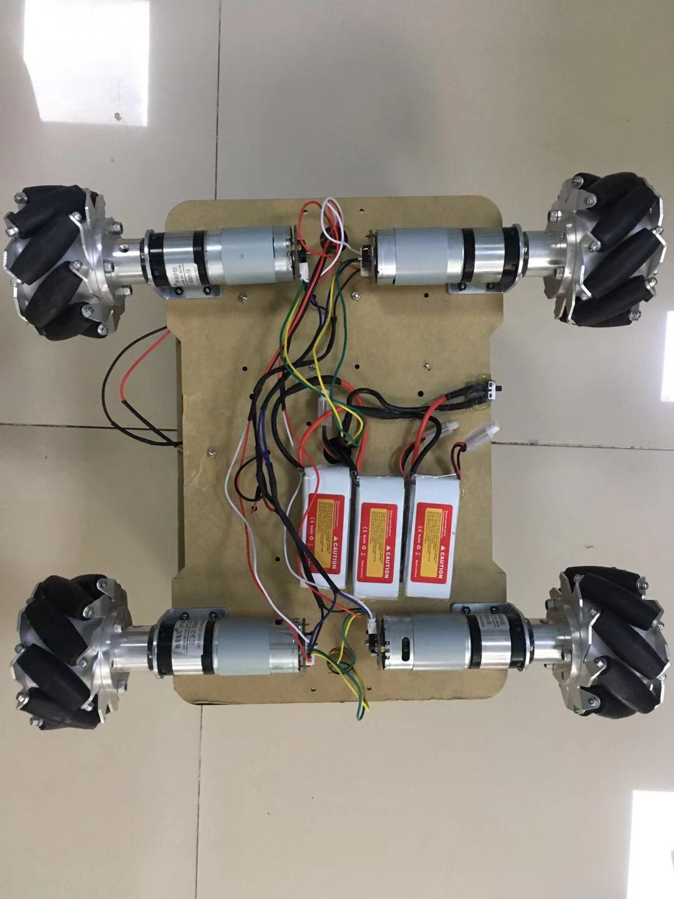

# 电池改造

为了获取24V高电压，我们需要将3节7.4V航模电池正负极串联起来（操作过程千万主要同一个电池正负不要碰到）并安装一个拨动开关，改造之后的电池如下：

# 供电连接
我们先把所需的供电需求列出来
|模块|需要电压|供电方式|
|----|----|----|
|Lot-Board|+5V|电池经过LM2596S降压到5V|
|电机驱动板电源接口|+24V|电池电压直出|
|电机驱动板5V引脚|+3.3V|lot-board的GPIO电平一致所以只能给3.3V否则pwm不能调速|
|编码电机5V|+5V|电池经过LM2596S降压到5V|
接线如下：

# 主控板GPIO口引脚规划如下
|Lot-Board GPIO引脚名字| GPIO引脚序号|PWM name|PWM channel|电机驱动板引脚|
|------|------|------|------|------|
|PD12|59|pwm4|channel 1|电机驱动板A 引脚EN1|
|PD13|60|| |电机驱动板A 引脚IN1|
|PA4|29|||电机驱动板A 引脚IN2|
|PB8|95|pwm4|channel 3|电机驱动板A 引脚EN2|
|PB9|96|||电机驱动板A 引脚IN3|
|PA8|67|||电机驱动板A 引脚IN4|
|PA0|23|pwm2|channel 1|电机驱动板B 引脚EN1|
|PA1|24|||电机驱动板B 引脚IN1|
|PC2|17|||电机驱动板B 引脚IN2|
|PB10|3|pwm2|channel 1|电机驱动板B 引脚EN2|
|PB11|48|||电机驱动板B 引脚IN3|
|PC4|33|||电机驱动板B 引脚IN4|
|PB12|51|||左前编码电机A|
|PB13|52|||左前编码电机B|
|PB14|53|||右前编码电机A|
|PB15|54|||右前编码电机B|
|PD14|61|||左后编码电机A|
|PD15|62|||左后编码电机B|
|PC6|63|||右后编码电机A|
|PC7|64|||右后编码电机B|

# 整机安装效果图

## 正面

## 背面

# 接线非常凌乱，所幸测试工作正常，开始码code之路......