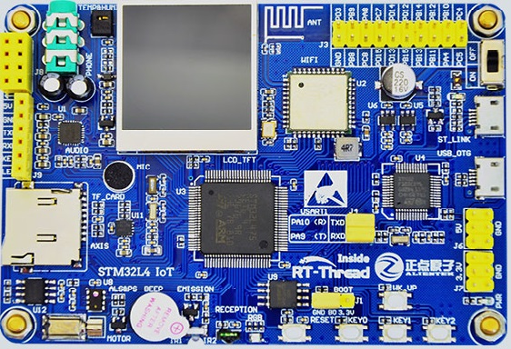
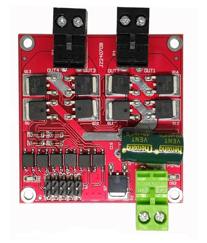
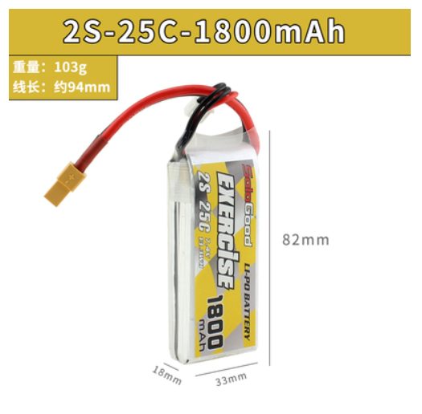
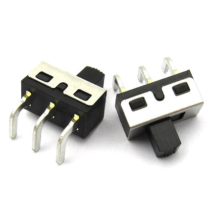
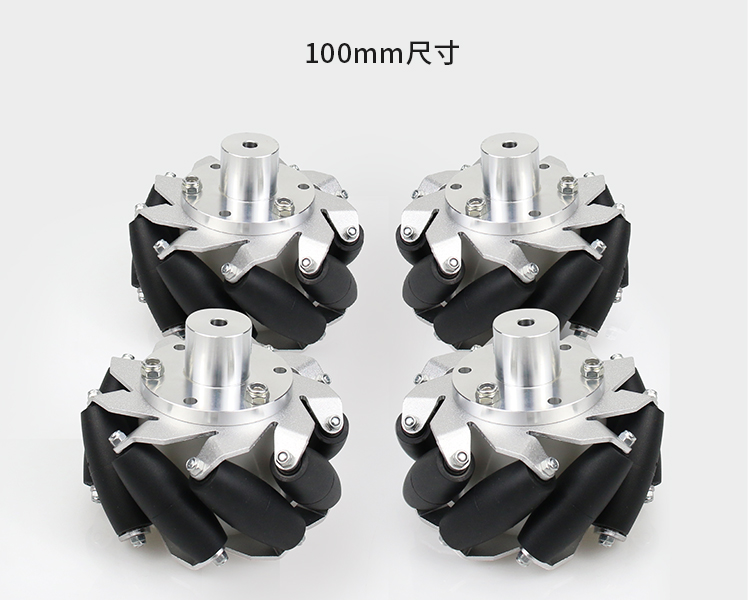
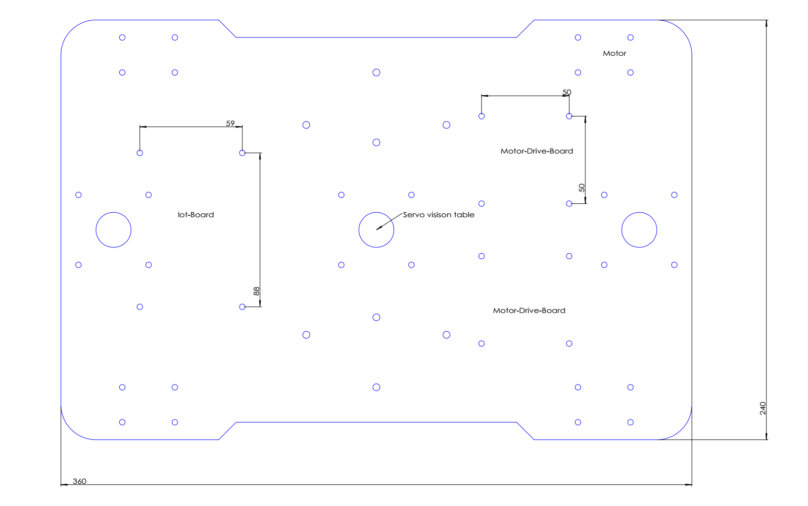

# 器件选型篇
在做这个车之前，有参考大量资料和车模，和队友们一起商量，希望做一台类似大疆步兵战车，希望动力十足，行动迅速
所以我们在器件选型的时候大量参考了RobotMaster的器件参数，但是考虑大疆配件昂贵，我们全部自己综合价格和性能选型。

1. 主板采用官方推荐潘多拉IoT Board
特点：
- MCU:STM32L475 
- 主频:80M 
- 完善RT-theard系统支持
- 板载AP6181
- 集成ST-Link非常方便调试

[淘宝购买链接](https://item.taobao.com/item.htm?spm=a1z09.2.0.0.6c972e8dSJTwVw&id=583527145598&_u=d33fu11t1ff1)

2. 电机选择
- 市面上各种直流电机种类特别多
- 主要有刷电机，无刷之分，考虑价格和够用原则 选择无刷直流电机
- 控制方式：霍尔编码，光电编码，电调，CAN 考虑控制简单和价格。

直接选用编码电机参数如下：

|   |电机参数|
|---|-------|
|类型|AB双相增量式霍尔编码电机|
|供电|电机24V，编码器5V|
|减速比| 1比19|
|额定转速|504rpm|
|额定转矩|14kg.cm|
|负载电流|2.6A|
|峰值电流|9.5A|
[淘宝购买链接](https://item.taobao.com/item.htm?spm=a1z09.2.0.0.6c972e8dSJTwVw&id=556515013795&_u=d33fu11tb1ec)

3. 电机驱动板选择
有了前面电机参数，我们选择驱动板就简单得多了，需要关注参数为驱动电压超过24V，驱动电流大于3A,功率要超过 3*24 = 72W.

淘宝找到如下一块满足要求

|       |产品参数|
|------|----------|
|供电电压| 6.5V~27V 不能超过27V|
|双路电机接口|没路额定输出电流7A，峰值50A|
|功率| 24V电机115W  12V电机40W|
|控制信号电平| 3~6.5V电压|

控制方式:

|IN1|IN2|ENA1|OUT1，OUT2输出|
|---|---|----|------|
|0|0|X|刹车|
|1|1|X|悬空|
|1|0|PWM|正转调速|
|0|1|PWM|反转调速|
|1|0|1|全速正转|
|0|1|1|全速反转|
[淘宝购买链接](https://item.taobao.com/item.htm?spm=a230r.1.14.236.6a7d311472Dgvq&id=593835172612&ns=1&abbucket=18#detail)

4. 电池和开关选择
前面电机需要24V供电，所以需要串联3组2S 7.4V锂电池组（或者2组3S 11.1V电池组）我们选用3组1800mA 25C航模电池，最大放电 1.8A*25 = 45A,大于 4个电机,峰值电流4*9=36A要求

 

[淘宝购买链接](https://item.taobao.com/item.htm?spm=a1z09.2.0.0.6c972e8dSJTwVw&id=576184061821&_u=d33fu11t2527)

5. 电压降压模块
选用LM2596S 24V转5V,最大电流3A,给lot-board和编码电机供电

[淘宝购买链接](https://item.taobao.com/item.htm?spm=a1z09.2.0.0.6c972e8dSJTwVw&id=576184061821&_u=d33fu11t2527)

7. 麦克纳姆轮
我们购买了100mm 具体参数如下:

|型号| 100mm直径|
|----|--------|
|重量|1.52kg|
|负载能力|40kg|
|厚度|50mm|
|支撑轮抽直径|3mm|
|支撑轮个数|9个|

[淘宝购买链接](https://item.taobao.com/item.htm?spm=a1z09.2.0.0.6c972e8dSJTwVw&id=569166349044&_u=d33fu11t43b8)

8. 底盘
由于我们器材都是自选，市面上底盘都无法安装，所以只要自己画个底盘，为了方便调试先做成亚克力，后面定型再做成铝合金

[底盘soildworks设计文件](https://github.com/Eronwu/roc_robot/tree/master/application/roc_car/docs/roc_robot_structure.SLDDRW)

### 组合图

