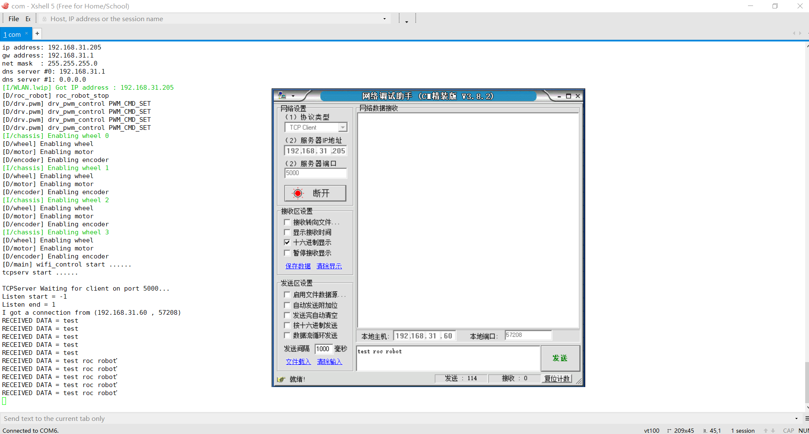

# BSP code base选择
由于购买是Lot-Board潘多拉主板有两个bsp可以使用第一个是https://github.com/RT-Thread/rt-thread
整个软件比较庞大，支持非常多型号主板和芯片，架构也完善。
另外一个是 https://github.com/RT-Thread/IoT_Board
这个是专门针对潘多拉板子官方做得bsp，潘多拉板子上所有硬件的库都完美支持，拿来即可用，比如板载wifi AP6181完全移植好，只需要实现tcp service即可完成wifi遥控。

一开始我这边是用RT-Thread BSP移植好pwm，一切调试正常，后面移植wifi时发现，AP6181,lwip，wlan等网络组件默认并没有打开，一顿操作终于移植完成，最后移植编译正常，发现无法连接wifi, 由于对wifi驱动了解不深，解决不了最后只好放弃这个方案。
直接使用Lot-Board固件的wifi_manage工程，wifi问题解决，但是这个固件也不完美，这个板子是专门物联网开发的，对于pwm配置工程里面本身不包含配置选型，这样就需要把pwm从驱动到应用到配置去打通，下面是移植简单过程。

# pwm驱动移植
本次制作的小车驱动方式为单pwm驱动方式，两个IO控制电机方向，具体看之前驱动板的介绍。

早已习惯源码简单粗暴的开发方式 我并没有去使用STM32官网先进的工具stm32CubeMX
首先找到pwm驱动入口文件drivers\drv_pwm.c
stm32_pwm_init(void)函数开始查看代码
根据之前配置好的pwm频道
```
#define LEFT_FORWARD_PWM            "pwm4"
#define LEFT_FORWARD_PWM_CHANNEL    1           // GPIO PD12

#define LEFT_BACKWARD_PWM           "pwm4"   
#define LEFT_BACKWARD_PWM_CHANNEL   3          // GPIO PB8

#define RIGHT_FORWARD_PWM           "pwm2"
#define RIGHT_FORWARD_PWM_CHANNEL   1          // GPIO PA0

#define RIGHT_BACKWARD_PWM          "pwm2"
#define RIGHT_BACKWARD_PWM_CHANNEL   3          // GPIO PB10

````
填充相关枚举和结构体
````
宏定义 PWM2_CONFIG  PWM4_CONFIG
static struct stm32_pwm stm32_pwm_obj[] 
最后rtconfig.h
#define RT_USING_PWM

#define BSP_USING_PWM
#define BSP_USING_PWM2
#define BSP_USING_PWM2_CH1
#define BSP_USING_PWM2_CH2
#define BSP_USING_PWM2_CH3
#define BSP_USING_PWM2_CH4
#define BSP_USING_PWM4
#define BSP_USING_PWM4_CH1
#define BSP_USING_PWM4_CH2
#define BSP_USING_PWM4_CH3
#define BSP_USING_PWM4_CH4

````
实现如下几个函数，一定要注意时钟的使能

````
void HAL_TIM_Base_MspInit(TIM_HandleTypeDef* htim_base)
void HAL_TIM_PWM_MspInit(TIM_HandleTypeDef *htim)
static void pwm_get_channel(void)
````

在调试pwm的过程中 我们如果遇到电机不动，可以如下将drv_pwm的log打开，然后看log哪里出错，如果整个流程都通还不动，可以对照pwm裸机程序调试
    #define DBG_SECTION_NAME     "drv.pwm"
    #define DBG_LEVEL     DBG_LOG
    #include <rtdbg.h>

# wifi tcp service收发数据
Lot-board板载wifi实在觉得另外接wifi或者其他控制方式没有必要，所以只需要实现tcp service就可以了
````
void tcprecvserv(void *parameter)
{
    unsigned char *recv_data; 
    socklen_t sin_size;
    int sock, bytes_received;
    struct sockaddr_in server_addr, client_addr;
    rt_bool_t stop = RT_FALSE;
    int ret;
    int nNetTimeout = 20;
    recv_data = (unsigned char *)rt_malloc(BUFFER_SIZE);
    rt_kprintf("tcpserv start ......\n");
    if (recv_data == RT_NULL)
    {
        rt_kprintf("No memory\n");
        return;
    }

    if ((sock = socket(AF_INET, SOCK_STREAM, 0)) == -1)
    {
        rt_kprintf("Socket error\n");

        rt_free(recv_data);
        return;
    }

    server_addr.sin_family = AF_INET;
    server_addr.sin_port = htons(5000);
    server_addr.sin_addr.s_addr = INADDR_ANY;
    rt_memset(&(server_addr.sin_zero), 0, sizeof(server_addr.sin_zero));
    setsockopt(sock, SOL_SOCKET, SO_RCVTIMEO, (char *)&nNetTimeout, sizeof(int)); 
    if (bind(sock, (struct sockaddr *)&server_addr, sizeof(struct sockaddr)) == -1)
    {
        rt_kprintf("Unable to bind\n");
        rt_free(recv_data);
        return;
    }

    if (listen(sock, 5) == -1)
    {
        rt_kprintf("Listen error\n");

        /* release recv buffer */
        rt_free(recv_data);
        return;
    }

    rt_kprintf("\nTCPServer Waiting for client on port 5000...\n");
    while (stop != RT_TRUE)
    {
        sin_size = sizeof(struct sockaddr_in);

        rt_kprintf("Listen start = %d\n", connected);
        connected = accept(sock, (struct sockaddr *)&client_addr, &sin_size);
        rt_kprintf("Listen end = %d\n", connected);
        if (connected < 0)
        {
            rt_kprintf("accept connection failed! errno = %d\n", errno);
            continue;
        }

        rt_kprintf("I got a connection from (%s , %d)\n",
        inet_ntoa(client_addr.sin_addr), ntohs(client_addr.sin_port));

        while (1)
        {
            bytes_received = recv(connected, recv_data, BUFFER_SIZE, MSG_WAITALL);
            if (bytes_received < 0)
            {
                closesocket(connected);
                break;
            } else if (bytes_received == 0) {
                rt_kprintf("\nReceived warning,recv function return 0.\r\n");
                closesocket(connected);
                connected = -1;
                break;
            }
           rt_ringbuffer_put_force(tcp_dat, (const rt_uint8_t *)recv_data, bytes_received);
        }
    }

    closesocket(sock);
    rt_ringbuffer_destroy(tcp_dat);
    rt_free(recv_data);
    return ;
}
````

默认端口号为5000 ，这里特别强调一下，wifi收数据时一开始收发不知道怎么处理，正打算实现做一个ringbuffer,结果一看RT-thread有个rt_ringbuffer非常好用，使用也非常简单，解决收数据，解析数据一大麻烦
rt_ringbuffer_create(2*BUFFER_SIZE); 创建ringbuffer
rt_ringbuffer_put_force(tcp_dat, (const rt_uint8_t *)recv_data, bytes_received);  wifi收到数据后往buffer写数据
然后主循环里只需要判断是否有数据就行
    while (rt_ringbuffer_data_len(tcp_dat) != 0) {
        ......
        rt_ringbuffer_getchar(tcp_dat, &dat);
        .....
        }
就可以了，完全不用担心丢包问题
好了wifi测试来一张图



